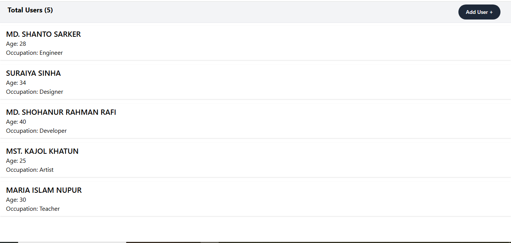
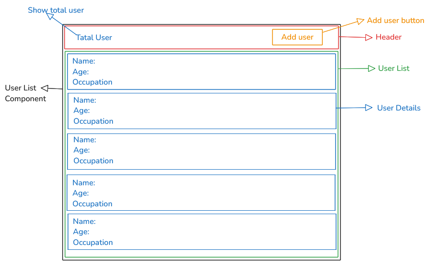
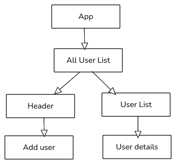
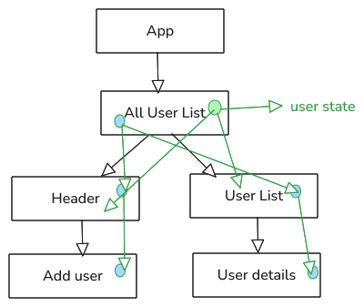

## Project UI Designe

## Component Breakdown Diagram

## Component Hierarchy diagram

## Identify State and Props

## How to run

1. Clone the repository
2. Install dependencies: `npm install`
3. Run the project: `npm run dev`

## Project Live Link

[Car Zone Live Link Here](https://react-with-tapascript-task-3.vercel.app/)